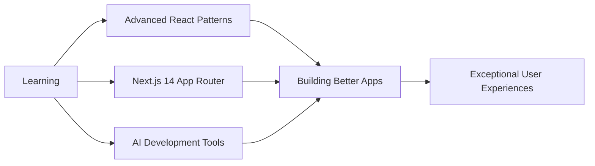

<div align="center">

<!-- Animated Wave Header with Gradient -->


<!-- Multi-line Typing Animation -->
[](https://git.io/typing-svg)

<!-- Animated Profile Badges -->
<p>
  
  
  
</p>


</div>

---

## 👨‍💻 About Me


```typescript
const akshay = {
    role: "Frontend Developer 💻",
    company: "Coded Realities (U.S.-Based Engineering Lab)",
    location: "📍 Islamabad, Pakistan",
    focus: ["Clean Code ✨", "User Experience 🎯", "Performance ⚡"],
    passion: "Building scalable & pixel-perfect web interfaces",
    currentlyLearning: ["Advanced React Patterns", "Next.js 14", "AI Tools"],
    funFact: "I turn coffee into code ☕ → 💻",
    
    getAmbition: () => {
        return "To craft exceptional digital experiences that users love";
    }
};
```

<br>

- 🏢 Working at **Coded Realities** - Building production-grade web applications
- 🎯 Specialized in **React.js** and **Next.js** for modern product development  
- 🎨 Converting **Figma designs** into responsive, pixel-perfect UI
- ⚡ Strong focus on **performance**, **accessibility**, and **UX best practices**
- 🤖 Exploring **AI-powered tools** to enhance development workflow
- 📚 Passionate about **clean code** and **best practices**
- 🌱 Always learning, always growing 🚀

<br clear="right"/>

---

## 🛠️ Tech Stack & Tools

<div align="center">

### 💻 Frontend Technologies

<p>
  
</p>

### 🔧 Development Tools

<p>
  
</p>

### 🤖 AI-Powered Workflow

<p>
  
  
  
  
  
</p>

</div>

---

## 🚀 What I Do Best

<div align="center">

<table>
<tr>
<td width="33%" align="center" valign="top">

### 🎨 UI/UX Implementation
Converting design files into production-ready code with pixel-perfect accuracy

</td>
<td width="33%" align="center" valign="top">

### ⚡ Performance
Optimizing web apps for lightning-fast load times and smooth interactions

</td>
<td width="33%" align="center" valign="top">

### 🔧 Modern Tooling
Leveraging latest frameworks and AI tools for efficient development

</td>
</tr>
</table>

</div>

---

## 📊 GitHub Statistics

<div align="center">


</div>

---


## 🎯 Current Focus

<div align="center">



</div>

---

## 📫 Let's Connect


**⭐️ From [akshaykumar-coded](https://github.com/akshaykumar-coded) with 💜**

</div>
