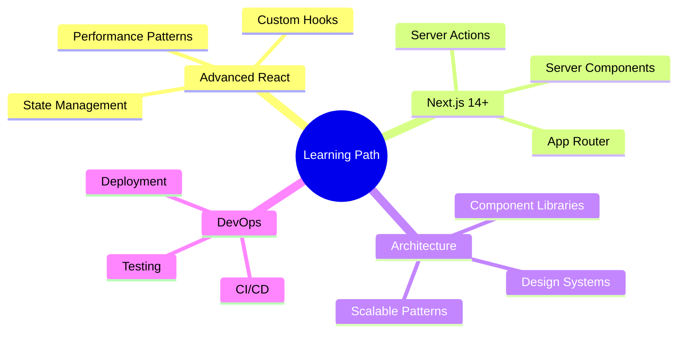

<div align="center">
  
  
  <p>
    
  </p>

  
</div>

<br/>

---

<br/>

##  About Me

```typescript
const akshay = {
  role: "Frontend Developer",
  company: "Coded Realities (U.S.-Based Engineering Lab)",
  location: "🇵🇰 Islamabad",
  focus: ["Clean Code", "User Experience", "Performance"],
  passion: "Building scalable & pixel-perfect web interfaces",
  currentlyLearning: ["Advanced React Patterns", "Next.js App Router"],
  funFact: "I turn coffee ☕ into code 💻"
};
```


### 🎯 Quick Highlights

<div align="center">

| 🏢 **Company** | ⚡ **Specialization** | 🎨 **Passion** | 🚀 **Current Focus** |
|:---:|:---:|:---:|:---:|
| Coded Realities | React & Next.js | UI/UX Excellence | AI-Powered Tools |

</div>

<details>
<summary><b>🔍 More About My Work</b></summary>

<br/>

- 🏢 Working at **Coded Realities** - Building production-grade web applications
- 🎯 Specialized in **React.js** and **Next.js** for modern product development
- 🎨 Converting **Figma designs** into responsive, pixel-perfect UI
- ⚡ Strong focus on **performance**, **accessibility**, and **UX best practices**
- 🤖 Exploring **AI-powered tools** to enhance development workflow
- 📚 Always learning and staying updated with latest web technologies

</details>

<br/>

---

<br/>

##  Tech Stack

<div align="center">

###  Frontend Development

<p>
  
</p>

###  Tools & Workflow

<p>
  
</p>

###  AI-Powered Development

<p>
  
  
  
  
</p>

</div>


<br/>

##  What I Do

<div align="center">

<table>
<tr>
<td width="33%" align="center">
  
  
  ### 🎨 UI Development
  
  Pixel-perfect, responsive interfaces from Figma to code
  
  
</td>
<td width="33%" align="center">
  
  
  ### ⚡ Performance
  
  Optimized, fast-loading web applications
  
  ```javascript
  Lighthouse: 95+ ✅
  FCP: < 1.8s ✅
  LCP: < 2.5s ✅
  ```
</td>
<td width="33%" align="center">
  
  
  ### 🧩 Clean Code
  
  Scalable, maintainable, and reusable components
  
  ```tsx
  DRY ✅
  SOLID ✅
  Tested ✅
  ```
</td>
</tr>
</table>

</div>

<br/>

---

<br/>

##  GitHub Stats

<div align="center">
  
  
  
  <br/><br/>
  
  
  
  
  <br/><br/>
  
  
</div>

<br/>

---

<br/>

##  Currently Learning

<div align="center">



</div>

<br/>

---

<br/>

##  Connect With Me

<div align="center">
  
  <a href="https://github.com/akshaykumar-coded">
    
  </a>
  <a href="https://linkedin.com/in/akshaykumar-coded">
    
  </a>
  <a href="mailto:akshay@codedrealities.com">
    
  </a>
  <a href="https://twitter.com/akshaykumar_dev">
    
  </a>

  <br/><br/>
  
  
  
  <br/>
  
  ### ⭐ *Building thoughtful digital experiences with clean code & modern tools* ⭐
  
  
  
  <br/>
  
  <sub>💜 Crafted with passion by Akshay | Last Updated: December 2024</sub>

</div>

---

<div align="center">
  
  **"Code is like humor. When you have to explain it, it's bad."** – Cory House
  
  

</div>
