<div align="center">

<!-- Header with animated wave -->


<h3>🚀 Engineering Innovation Through Code</h3>

[](https://git.io/typing-svg)

<p>
  
  
  
</p>

</div>

---

<div align="center">

## 🌟 **Welcome to Our Engineering Hub**

*Transforming Ideas into Elegant Digital Experiences*

</div>

<table align="center">
<tr>
<td align="center" width="33%">
  
### 🎯 **Mission-Driven**
Building products that matter with clean, scalable code

</td>
<td align="center" width="33%">

### 🚀 **Quality-First**
Every line of code reflects our commitment to excellence

</td>
<td align="center" width="33%">

### 💡 **Innovation**
Leveraging cutting-edge tech to solve real problems

</td>
</tr>
</table>

---

<div align="center">

## 👥 **Meet Our Team**

</div>

<table align="center">
  <tr>
    <td align="center" width="400">
      <a href="https://github.com/akshaykumar-coded">
        
      </a>
      <br />
      <br />
      <h3>👨‍💻 Akshay Kumar</h3>
      <p><b>Frontend Developer</b></p>
      <p><i>React & Next.js Specialist</i></p>
      <br />
      <p>
        
        
      </p>
      <p>
        <a href="https://github.com/akshaykumar-coded">
          
        </a>
      </p>
      <p>
        ✨ Crafting pixel-perfect UIs<br/>
        ⚡ Performance optimization expert<br/>
        🎨 Design-to-code specialist
      </p>
    </td>
  </tr>
</table>

---

<div align="center">

## 🎯 **What We Do**

</div>

<table>
<tr>
<td width="33%" align="center">

### 🎨 **UI/UX Excellence**

```
✓ Pixel-perfect implementations
✓ Design system integration
✓ Accessible interfaces
✓ Responsive layouts
✓ Mobile-first approach
```

</td>
<td width="33%" align="center">

### ⚡ **Performance First**

```
✓ Core Web Vitals optimized
✓ Lazy loading strategies
✓ Code splitting
✓ Bundle optimization
✓ SEO-friendly
```

</td>
<td width="33%" align="center">

### 🧩 **Scalable Architecture**

```
✓ Component-driven
✓ Type-safe development
✓ Reusable patterns
✓ Clean code principles
✓ Maintainable structure
```

</td>
</tr>
</table>

---

<div align="center">

## 🛠️ **Our Technology Arsenal**

### **Frontend Powerhouse**

<p>
  
</p>

### **Design & Development Tools**

<p>
  
</p>

### **AI-Powered Workflow**

<p>
  
  
  
</p>

</div>

---

<div align="center">

## 📊 **Project Portfolio**

</div>

```ascii
╔═══════════════════════════════════════════════════════════════╗
║                    📦 ACTIVE PROJECTS                         ║
╠═══════════════════════════════════════════════════════════════╣
║                                                               ║
║  🎨 CLIENT WEB APPLICATIONS                                  ║
║     ├── 🛒 E-commerce Platforms                              ║
║     ├── 📊 SaaS Dashboards                                   ║
║     ├── 🌐 Marketing Websites                                ║
║     └── 📱 Progressive Web Apps                              ║
║                                                               ║
║  🔧 INTERNAL TOOLS                                           ║
║     ├── 📚 Component Libraries                               ║
║     ├── 🎨 Design System Templates                           ║
║     ├── 🤖 Code Generators                                   ║
║     └── 📝 Documentation Sites                               ║
║                                                               ║
║  🧪 EXPERIMENTAL                                             ║
║     ├── 🤖 AI Integrations                                   ║
║     ├── ⚡ Performance Benchmarks                            ║
║     ├── 🎭 Animation Libraries                               ║
║     └── 🚀 Next-gen UI Patterns                              ║
║                                                               ║
╚═══════════════════════════════════════════════════════════════╝
```

---

<div align="center">

## 🌟 **Our Development Philosophy**

</div>

<table>
<tr>
<td width="20%" align="center">

### 🎯
**User-Centric**

Every decision starts with the end user

</td>
<td width="20%" align="center">

### ✨
**Clean Code**

Readable, maintainable solutions

</td>
<td width="20%" align="center">

### 🚀
**Performance**

Fast experiences everywhere

</td>
<td width="20%" align="center">

### 🔄
**Iterative**

Continuous improvement

</td>
<td width="20%" align="center">

### 🤝
**Collaborative**

Strong team synergy

</td>
</tr>
</table>

---

<div align="center">

## 📈 **GitHub Statistics**


</div>

---

<div align="center">

## 🔥 **Current Focus Areas**

</div>

<table>
<tr>
<td width="50%">

### 🎯 **Technical Excellence**

- 🔹 Advanced React patterns & hooks
- 🔹 Next.js 14+ App Router
- 🔹 Performance optimization techniques
- 🔹 Server Components & RSC
- 🔹 State management solutions

</td>
<td width="50%">

### 🎨 **Design Systems**

- 🔹 Component library development
- 🔹 Design token management
- 🔹 Accessibility (WCAG 2.1 AA)
- 🔹 Responsive design patterns
- 🔹 Animation & micro-interactions

</td>
</tr>
<tr>
<td width="50%">

### 🤖 **AI Integration**

- 🔹 AI-assisted code development
- 🔹 Workflow automation
- 🔹 Code quality enhancement
- 🔹 Smart documentation
- 🔹 Intelligent debugging

</td>
<td width="50%">

### 🚀 **Client Success**

- 🔹 Timely project delivery
- 🔹 Clear communication
- 🔹 Scalable architecture
- 🔹 Comprehensive documentation
- 🔹 Long-term maintainability

</td>
</tr>
</table>

---

<div align="center">

## 💡 **Our Approach**

```mermaid
graph LR
    A[📋 Requirements] --> B[🎨 Design]
    B --> C[⚙️ Development]
    C --> D[🧪 Testing]
    D --> E[🚀 Deployment]
    E --> F[📊 Monitoring]
    F --> G[🔄 Iteration]
    G --> A
    
    style A fill:#bb86fc,stroke:#fff,stroke-width:2px,color:#000
    style B fill:#bb86fc,stroke:#fff,stroke-width:2px,color:#000
    style C fill:#bb86fc,stroke:#fff,stroke-width:2px,color:#000
    style D fill:#bb86fc,stroke:#fff,stroke-width:2px,color:#000
    style E fill:#bb86fc,stroke:#fff,stroke-width:2px,color:#000
    style F fill:#bb86fc,stroke:#fff,stroke-width:2px,color:#000
    style G fill:#bb86fc,stroke:#fff,stroke-width:2px,color:#000
```

</div>



---

<div align="center">

## 🏆 **Why Choose Us**

</div>

<table>
<tr>
<td align="center" width="25%">

### ⚡
**Fast Delivery**

Agile methodology ensures quick turnarounds

</td>
<td align="center" width="25%">

### 🎯
**Pixel Perfect**

Attention to detail in every implementation

</td>
<td align="center" width="25%">

### 🔒
**Reliable Code**

Thoroughly tested, production-ready

</td>
<td align="center" width="25%">

### 📈
**Scalable**

Built to grow with your business

</td>
</tr>
</table>

---

<div align="center">

## 💼 **Work With Us**

Our repositories showcase:

<p>
  
  
  
  
</p>

</div>

---

<div align="center">

## 📫 **Get In Touch**

<p>
  <a href="https://github.com/coded-realities">
    
  </a>
  <a href="https://github.com/akshaykumar-coded">
    
  </a>
</p>

---

### ⭐ *"Crafting Digital Realities with Precision and Passion"* ⭐

---


</div>

<!-- Footer wave -->

